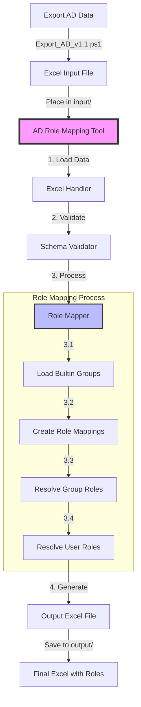

# AD Role Mapping Tool

A Python tool for mapping Active Directory groups to roles and managing role assignments.

## Overview

The AD Role Mapping Tool processes Active Directory data exported to Excel format and:
1. Maps predefined AD groups to roles based on configuration
2. Creates role definitions and role-group mappings
3. Validates data integrity and relationships
4. Outputs a standardized Excel file with role information

### Process Flow



## Features

- **AD Group to Role Mapping**: Maps specified AD groups to roles based on configuration
- **Data Validation**: Validates input data against schema requirements
- **Role Resolution**: Resolves role assignments through group hierarchies
- **Excel Integration**: Reads from and writes to Excel files with multiple sheets
- **Logging**: Comprehensive logging with configurable levels
- **Error Handling**: Robust error handling with descriptive messages

## Installation

1. Clone the repository:
```bash
git clone https://github.com/yourusername/ad-role-mapping-tool.git
cd ad-role-mapping-tool
```

2. Run the initialization script:
```bash
./init.sh
```

This will:
- Create a Python virtual environment
- Install required dependencies
- Set up logging
- Configure pre-commit hooks

## Usage

1. Export AD data using the provided PowerShell script:
```powershell
.\Export_AD_v1.1.ps1
```

2. Place the exported Excel file in the `input` directory.

3. Run the tool:
```bash
./init.sh process input/ad_export.xlsx output/role_mappings.xlsx
```

### Input Format

The input Excel file must contain these sheets:
- `Users`: AD user information
- `Groups`: AD group information
- `User_Groups`: User-group memberships
- `Group_Groups`: Group hierarchy relationships

### Output Format

The tool generates an Excel file with these sheets:
- All input sheets (Users, Groups, User_Groups, Group_Groups)
- `Roles`: Role definitions mapped from AD groups
- `Role_Groups`: Role-group mappings
- `User_Roles`: User role assignments
- `Group_Roles`: Group role assignments

## Configuration

### Builtin Groups

Edit `src/builtin_groups.json` to specify which AD groups should be mapped to roles:

```json
{
  "Original_Role_Groups": [
    "Domain Admins",
    "Administrators",
    "Print Operators"
  ],
  "Additional_Role_Groups": [
    "Exchange Admins"
  ]
}
```

### Logging

Set the `LOG_LEVEL` environment variable to control logging (DEBUG, INFO, WARNING, ERROR, CRITICAL).
Default: INFO

## Development

### Project Structure

```
.
├── src/
│   ├── utils/
│   │   ├── excel_handler.py   # Excel file operations
│   │   ├── role_mapper.py     # Role mapping logic
│   │   └── schema_validator.py # Data validation
│   ├── AD_oracle.py           # Main script
│   └── builtin_groups.json    # Role group configuration
├── tests/                     # Test suite
├── input/                     # Input files directory
├── output/                    # Output files directory
├── docs/                      # Documentation
├── init.sh                    # Setup and run script
└── Export_AD_v1.1.ps1        # AD export script
```

### Testing

Run the test suite:
```bash
pytest tests/ -v
```

Run with coverage:
```bash
pytest tests/ -v --cov=src
```

### Contributing

1. Fork the repository
2. Create a feature branch
3. Make your changes
4. Run tests
5. Submit a pull request

## License

[Your License Here]

## Support

For issues and feature requests, please use the GitHub issue tracker.
